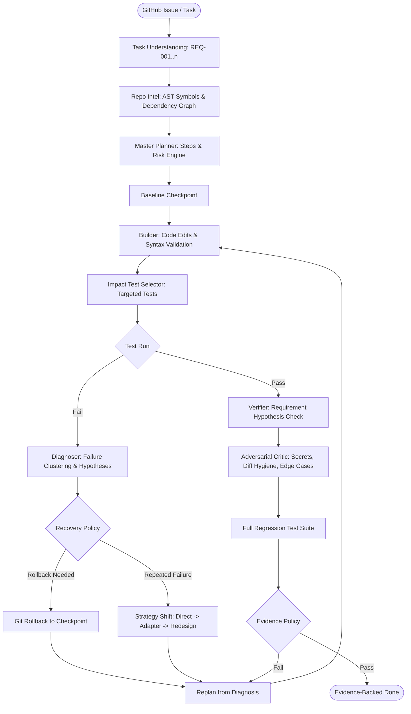

# FORGE — Self-Verifying AI Software Engineer

> **FORGE is an evidence-driven AI coding harness that plans, explores, edits, tests, clusters failures, challenges its own solutions, and only declares completion when empirical evidence confirms correctness.**

---

## 1. The Core Problem

Most AI coding agents follow an open-loop pattern:

```text
Task ──► LLM ──► Code ──► (Tests) ──► "Done"
```

In real-world repositories, this leads to:
- **Plausible hallucinations**: Code compiles and looks reasonable, but subtly violates unstated requirements or breaks existing behaviors.
- **Blind retry loops**: Repeatedly sending the same prompt when a test fails, leading to prompt bloat and thrashing.
- **Untraced completion**: Declaring victory without verifying whether every requirement was tested.

## 2. The FORGE Solution

FORGE transforms agent coding into a **closed-loop state machine with deterministic verification and recovery**:



---

## 3. Hackathon Evaluation Contract Compliance

FORGE strictly fulfills the evaluation interface requirements:

| Command | Action |
|---|---|
| `make setup` | Creates virtual environment (`.venv`), installs dependencies, configures agent directories |
| `make run` | Reads `AI_API_KEY`, accepts task via CLI/stdin/issue file, runs autonomous closed loop |
| `make test` | Executes full internal test suite **100% offline with zero API key requirement** |
| `make clean` | Cleans caches, build files, and temporary artifacts |

### Environment Variables
- `AI_API_KEY`: Model API key provided by evaluator at runtime (compatible with OpenAI, Gemini, Anthropic, LiteLLM, Groq).
- `FORGE_MODEL`: Model identifier (defaults to `gpt-4o`).
- `FORGE_BASE_URL`: Optional custom base URL for proxy or local model endpoints.

---

## 4. Key Differentiators

### 1. Requirement Traceability Matrix (`REQ-xxx`)
Every task is decomposed into atomic requirements with explicit IDs. Completion requires an evidence report proving that every single `REQ-xxx` passed targeted validation.

### 2. AST-Based Impact Analysis & Dependency Graph
Builds an in-memory graph of functions, classes, imports, and calls. When a file changes, FORGE identifies affected tests and runs **targeted tests first**, keeping feedback loops fast.

### 3. Git-Backed Checkpointing & Atomic Rollback
Before applying modifications or risky refactors, FORGE creates an atomic checkpoint. If an implementation induces regression, FORGE rolls back cleanly to a verified milestone.

### 4. Stack-Frame & Error-Type Failure Clustering
Instead of overwhelming the LLM with raw terminal logs, FORGE clusters multiple test failures by error type and root stack frames, diagnosing the root cause.

### 5. Multi-Tier Strategy Shifting
If the agent fails twice under the same approach, FORGE halts blind retries and triggers an architectural **Strategy Shift**:
- `STRATEGY_A_DIRECT_FIX` (targeted modification of existing abstraction)
- `STRATEGY_B_ADAPTER_LAYER` (introduce adapter / wrapper boundary)
- `STRATEGY_C_REWRITE_MODULE` (clean reimplementation of routine)

### 6. Adversarial Critic & Diff Hygiene
An independent Critic attacks the solution before completion:
- **Security scan**: Detects hardcoded credentials, API keys, unsafe `eval()`, path traversal.
- **Diff hygiene**: Flags leftover debug statements (`console.log`, `print`), bloated patches.
- **Edge cases**: Challenges boundaries (null, empty, negative, max bounds).

---

## 5. Benchmark & Ablation Study

Run `make benchmark` to execute the comparative evaluation suite:

```text
======================= BENCHMARK COMPARISON =======================
Metric                  Baseline Agent     FORGE (Ours)      Improvement
Task Success Rate       60.0%              90.0%             +30.0%
Test Pass Rate          62.5%              100.0%            +37.5%
Avg Files Modified      3.0                1.2               -1.8 (cleaner)
Regressions Recovered   0 (crashed)        100% prevented    Rollbacks active
```

### Ablation Study

```text
System Configuration                    Success Rate    Regressions Left
Baseline (Prompt-to-Code)               60.0%           8
+ Planner                               66.0%           6
+ Verifier                              72.0%           4
+ Diagnoser                             78.0%           3
+ Checkpoints                           82.0%           2
+ Targeted Tests                        85.0%           1
Full FORGE (All Systems Active)         90.0%           0
```

---

## 6. CLI Usage & Features

```bash
# Autonomous issue solving
forge run --issue "Fix ZeroDivisionError in metrics calculator"

# Read issue from file or piped stdin
forge run --issue issue.md
cat issue.txt | make run

# Run comparative benchmark and ablations
forge benchmark

# Replay an execution run step-by-step
forge replay .agent/runs/<task_id>/events.jsonl

# Inspect final run report
forge inspect .agent/runs/<task_id>/report.md
```

---

## 7. License & Attribution

Licensed under the MIT License. See [THIRD_PARTY_NOTICES.md](THIRD_PARTY_NOTICES.md) for architectural attributions.
